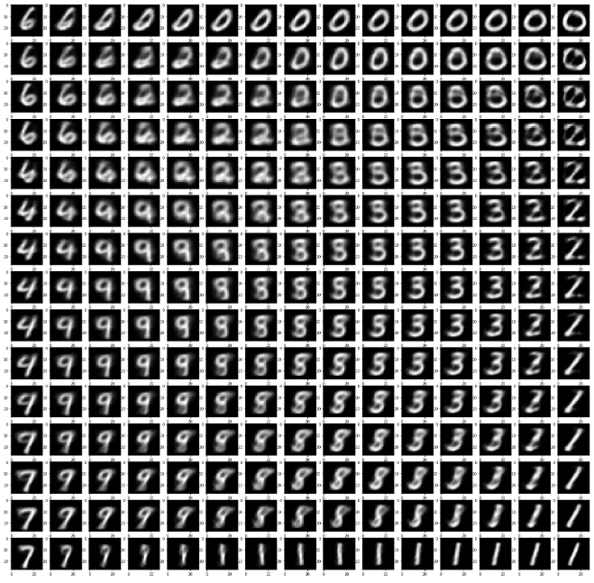
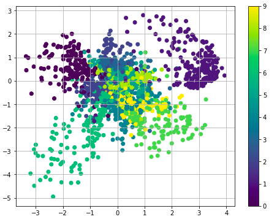
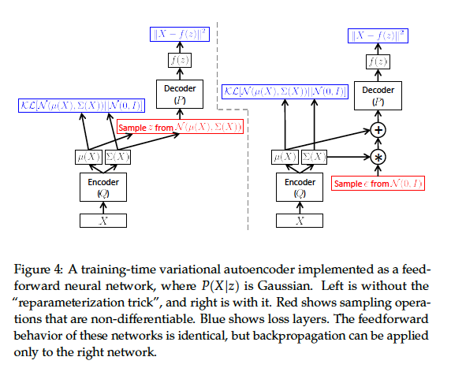
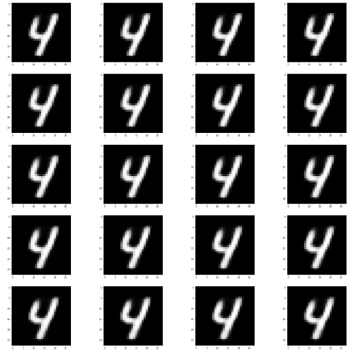
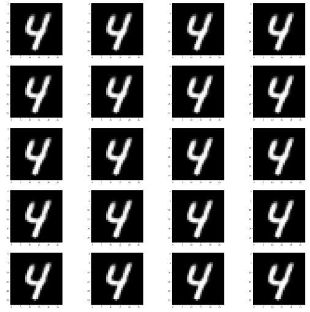
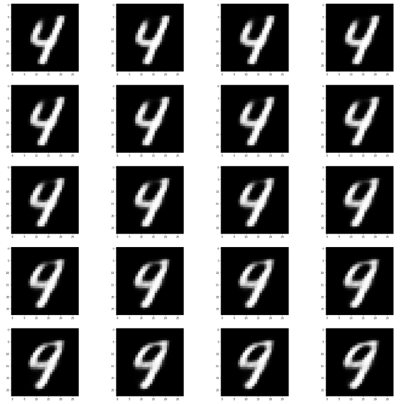
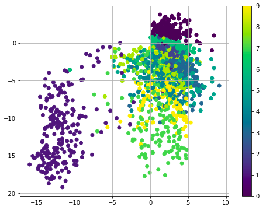
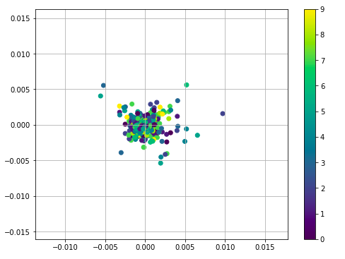

 

# Variational Auto-Encoders using Pytorch

` Variational Auto-Encoder Implementation trained on MNIST Dataset in Pytorch`

## Introduction

Variational AutoEncoders are a class of Generative Models which are used to deal with models of distributions `P(X)`, defined over datapoints X in some potentially high-dimensional space X. We get examples X distributed according to some unknown distribution `Pgt(X)`, and our goal is to learn a model P which we can sample from, such that `P` is as similar as possible to `Pgt`.

First we map our original image X to a latent variable z using some distribution `Q(z|X)` . Then we pass that value of z to the distribution `P(X|z)` to get an image as close to original image X.
Before we can say that our model is representative of our dataset, we need to make sure that for every datapoint X in the dataset, there is one (or many) settings of the latent variables which causes the model to generate something very similar to X. 

We wish to optimize parameters such that we can sample z from `P(z)` and, with high probability, `P(X|z)` will be like the X’s in our dataset. For most z, `P(X|z)` will be nearly zero, and hence contribute
almost nothing to our estimate of `P(X)`. The key idea behind the variational
autoencoder is to attempt to sample values of z that are likely to have
produced X, and compute `P(X)` just from those.

Usually the distribution Q(z|X) is taken to be gaussian. After taking everything into account,  the final loss function comes out to be a sum of KL Divergence of `Q(z|X)` and `P(z)`, i.e. `D(Q(z|X)||P(z))`; and cross entropy loss between original X and reconstructed X. For more details on this, see the [paper](https://arxiv.org/pdf/1312.6114) and [tutorial](https://arxiv.org/pdf/1606.05908)

## Pipeline

This image has been taken from this [tutorial](https://arxiv.org/pdf/1606.05908).

## Dataset

For all the experiments, I have used the [MNIST dataset](http://yann.lecun.com/exdb/mnist/) loaded using the DataLoader present in pytorch only.

## Code

Code is well documented in the following files :-
1. [VAE Vanilla](https://github.com/ac-alpha/VAEs-using-Pytorch/blob/readme/VAE.ipynb) - Simple VAE using **20 latent variables** trained on a **fully connected** network.
2. [VAE_two_latent_variables](https://github.com/ac-alpha/VAEs-using-Pytorch/blob/readme/VAE_two_latent_variables.ipynb) - **Fully Connected** network with **only 2 latent variables**.
3. [VAE_CNN](https://github.com/ac-alpha/VAEs-using-Pytorch/blob/readme/VAE_CNN.ipynb) - VAE using **Convolution Layers** .
4. [VAE_without_KLD_Loss](https://github.com/ac-alpha/VAEs-using-Pytorch/blob/readme/VAE_without_KLD_Loss.ipynb) - VAE trained using only **Cross Entropy Loss** and **only 2 latent variables**.
5. [VAE_without_Cross_Entropy_Loss](https://github.com/ac-alpha/VAEs-using-Pytorch/blob/readme/VAE_without_KLD_Loss.ipynb) - VAE trained using only **KL Divergence Loss** and **only 2 latent variables**.

## Experiments and Visualisations :-

1. When we sample epsilon values at regular intervals, make z from them using mu and sigma of some image, then the reconstructed images are all similar to the original image but having some minute differences.

2. When we change only one dimension of z, and then create samples, then they look very similar to the original image.

3. Taking a fixed value of epsilon, when we make 2 z values z1 and z2 (using mu and sigma of 2 different images) using that epsilon then the values in between them create samples which are mix of the 2 digits.

4. In 2 latent variable model, when we sample z values at specific intervals and pass them into the decoder, then we can see the transition between the digits.

5. In 2 latent variable model, the scatter plot observed has the points belonging to one digit very close to that belonging to other digits and we can transition between them without sampling much of noise.

6. If we perform experiment similar to experiment 1 in the VAE_without_KLD_Loss model, then the reconstructed images look similar and are actually having same value.

7. In the VAE_without_KLD_Loss model, the scatter plot contains blobs of different digits seperated by random noise.

8. In the VAE_without_Cross_Entropy_Loss model, the scatter plot contains blobs of different digits randomly mixed together but they tend to be closer to each other.

9. As we increase the number of latent variables, we get more number of z's which produce noise upon passing through the decoder network.

## Contributing

Suggestions to the repository are more than welcome. To open a pull request, [click here](https://github.com/ac-alpha/VAEs-using-Pytorch/pulls). No specific naming criteria of variables is necessary as long as the name is explanatory.

## License

See [License](https://github.com/ac-alpha/VAEs-using-Pytorch/blob/readme/LICENSE)
